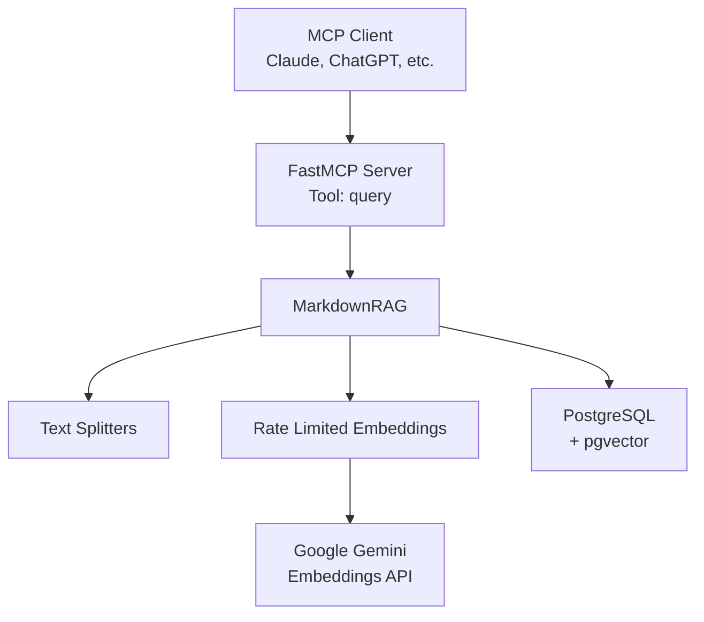

# Markdown RAG

A Retrieval Augmented Generation (RAG) system for markdown documentation with intelligent rate limiting and MCP server integration.

## Features

- **Semantic Search**: Vector-based similarity search using Google Gemini embeddings
- **Markdown-Aware Chunking**: Intelligent document splitting that preserves semantic boundaries
- **Rate Limiting**: Sophisticated sliding window algorithm with token counting and batch optimization
- **MCP Server**: Model Context Protocol server for AI assistant integration
- **PostgreSQL Vector Store**: Scalable storage using pgvector extension
- **Incremental Updates**: Smart deduplication prevents reprocessing existing documents
- **Production Ready**: Type-safe configuration, comprehensive logging, and error handling

## Installation

### Prerequisites

- Python 3.11+
- PostgreSQL 12+ with pgvector extension
- Google Gemini API key

### Using uv (Recommended)

```bash
git clone https://github.com/yourusername/markdown-rag.git
cd markdown-rag
uv sync
```

### Using pip

```bash
git clone https://github.com/yourusername/markdown-rag.git
cd markdown-rag
pip install -e .
```

## Quick Start

### 1. Configure Environment

Create a `.env` file in the project root:

```env
POSTGRES_USER=postgres
POSTGRES_PASSWORD=your_password
POSTGRES_HOST=localhost
POSTGRES_PORT=5432
POSTGRES_DB=embeddings
GOOGLE_API_KEY=your_gemini_api_key

RATE_LIMIT_REQUESTS_PER_MINUTE=100
RATE_LIMIT_REQUESTS_PER_DAY=1000
```

### 2. Set Up PostgreSQL

```bash
createdb embeddings
```

### 3. Ingest Documents

```bash
markdown-rag /path/to/docs --command ingest
```

### 4. Add the MCP server to your coding agent settings

```json
{
  "mcpServers": {
    "markdown-rag": {
      "command": "uv",
      "args": [
        "run",
        "markdown-rag",
        "/absolute/path/to/docs",
        "--command",
        "mcp"
      ],
      "env": {
        "POSTGRES_USER": "postgres",
        "POSTGRES_PASSWORD": "your_password",
        "POSTGRES_HOST": "localhost",
        "POSTGRES_PORT": "5432",
        "POSTGRES_DB": "embeddings",
        "GOOGLE_API_KEY": "your_gemini_api_key"
      }
    }
  }
}
```

### 5. Query via MCP

The server exposes a `query` tool that can be called by any MCP client:

```json
{
  "tool": "query",
  "arguments": {
    "query": "How do I configure authentication?"
  }
}
```

Response:

```json
[
  {
    "source": "docs/setup/auth.md",
    "content": "## Authentication Configuration\n\nTo configure authentication..."
  }
]
```

## Configuration

### Environment Variables

| Variable                         | Default      | Required | Description                 |
| -------------------------------- | ------------ | -------- | --------------------------- |
| `POSTGRES_USER`                  | `postgres`   | No       | PostgreSQL username         |
| `POSTGRES_PASSWORD`              | -            | **Yes**  | PostgreSQL password         |
| `POSTGRES_HOST`                  | `localhost`  | No       | PostgreSQL host             |
| `POSTGRES_PORT`                  | `5432`       | No       | PostgreSQL port             |
| `POSTGRES_DB`                    | `embeddings` | No       | Database name               |
| `GOOGLE_API_KEY`                 | -            | **Yes**  | Google Gemini API key       |
| `RATE_LIMIT_REQUESTS_PER_MINUTE` | `100`        | No       | Max API requests per minute |
| `RATE_LIMIT_REQUESTS_PER_DAY`    | `1000`       | No       | Max API requests per day    |

### Command Line Options

```bash
markdown-rag <directory> [OPTIONS]
```

**Arguments:**

- `<directory>`: Path to markdown files directory (required)

**Options:**

- `-c, --command {ingest|mcp}`: Operation mode (default: `mcp`)
  - `ingest`: Process and store documents
  - `mcp`: Start MCP server for queries
- `-l, --level {debug|info|warning|error}`: Logging level (default: `warning`)
  - `debug`: DEBUG
  - `info`: INFO
  - `warning`: WARNING
  - `error`: ERROR

**Examples:**

```bash
markdown-rag ./docs --command ingest --level info

markdown-rag ./knowledge-base --command mcp

markdown-rag /var/docs -c ingest -l debug
```

## Architecture

### System Components

The following diagram shows how the system components interact:



### Rate Limiting Strategy

The system implements a dual-window sliding algorithm:

- **Request Limits**: Tracks requests per minute and per day
- **Token Limits**: Counts tokens before API calls
- **Batch Optimization**: Calculates maximum safe batch sizes
- **Smart Waiting**: Minimal delays with automatic retry

See [Architecture Documentation](docs/architecture.md) for detailed diagrams.

## Development

### Setup Development Environment

```bash
git clone https://github.com/yourusername/markdown-rag.git
cd markdown-rag

uv sync
```

### Run Linters

```bash
uv run ruff check .

uv run mypy .
```

### Code Style

This project follows:

- **Linting**: Ruff with Google docstring convention
- **Type Checking**: mypy with strict settings
- **Line Length**: 79 characters
- **Import Sorting**: Alphabetical with isort

### Project Structure

```text
markdown-rag/
├── src/markdown_rag/
│   ├── __init__.py
│   ├── main.py              # Entry point and MCP server
│   ├── config.py            # Environment and CLI configuration
│   ├── models.py            # Pydantic data models
│   ├── rag.py               # Core RAG logic
│   ├── embeddings.py        # Rate-limited embeddings wrapper
│   └── rate_limiter.py      # Rate limiting algorithm
├── docs/
│   ├── api-reference.md     # API documentation
│   ├── architecture.md      # Architecture documentation
│   ├── mcp-integration.md   # MCP server integration guide
│   └── user-guide.md        # User guide
├── pyproject.toml           # Project configuration
├── .env                     # Environment variables (not in git)
└── README.md
```

## Troubleshooting

### Common Issues

#### "Failed to start store: connection refused"

**Cause**: PostgreSQL not running or wrong connection settings

**Solution**:

```bash
pg_ctl status

export POSTGRES_HOST=localhost
export POSTGRES_PORT=5432
```

#### "Rate limit exceeded"

**Cause**: Hitting Google Gemini API rate limits

**Solution**:

```env
RATE_LIMIT_REQUESTS_PER_MINUTE=50
RATE_LIMIT_REQUESTS_PER_DAY=500
```

#### "pgvector extension not found"

**Cause**: pgvector extension not installed

**Solution**:

```bash
psql embeddings -c "CREATE EXTENSION IF NOT EXISTS vector;"
```

#### "Skipping all files (already in vector store)"

**Cause**: Documents already ingested

**Solution**: This is expected behavior. The system prevents duplicate ingestion for efficiency.

### Logging

Enable debug logging to troubleshoot:

```bash
markdown-rag ./docs --command ingest --level debug
```

Debug output includes:

- Token counts per request
- Rate limit calculations
- Batch sizes
- API wait times
- Document processing progress

## Security

### Best Practices

- **Never commit `.env` files** - Add to `.gitignore`
- **Use environment variables** for all secrets
- **Restrict database access** - Use firewall rules
- **Rotate API keys** regularly
- **Use read-only database users** for query-only deployments

### Secrets Management

All secrets use `SecretStr` type to prevent accidental logging:

```python
from pydantic import SecretStr

api_key = SecretStr("secret_value")
```

## Contributing

1. Fork the repository
2. Create a feature branch (`git checkout -b feature/amazing-feature`)
3. Make changes and add tests
4. Run linters (`uv run ruff check .`)
5. Run type checks (`uv run mypy src/`)
6. Commit changes (`git commit -m 'feat: add amazing feature'`)
7. Push to branch (`git push origin feature/amazing-feature`)
8. Open a Pull Request

### Commit Message Format

Follow conventional commits:

```text
feat: add new feature
fix: resolve bug
docs: update documentation
refactor: improve code structure
test: add tests
chore: update dependencies
```

## TODOS

- Add parameter to query tool to adjust number of documents retrieved.
- Management of embeddings store via MCP tool.
- Add support for other embeddings models.
- Add support for other vector stores.

## License

This project is licensed under the MIT License.

## Acknowledgments

- [LangChain](https://github.com/langchain-ai/langchain) - RAG framework
- [Google Gemini](https://ai.google.dev/) - Embedding model
- [pgvector](https://github.com/pgvector/pgvector) - Vector similarity search
- [FastMCP](https://github.com/anthropics/fastmcp) - MCP server framework

## Support

- Documentation: [docs/architecture.md](docs/architecture.md)
- Issues: [GitHub Issues](https://github.com/yourusername/markdown-rag/issues)
- Discussions: [GitHub Discussions](https://github.com/yourusername/markdown-rag/discussions)
