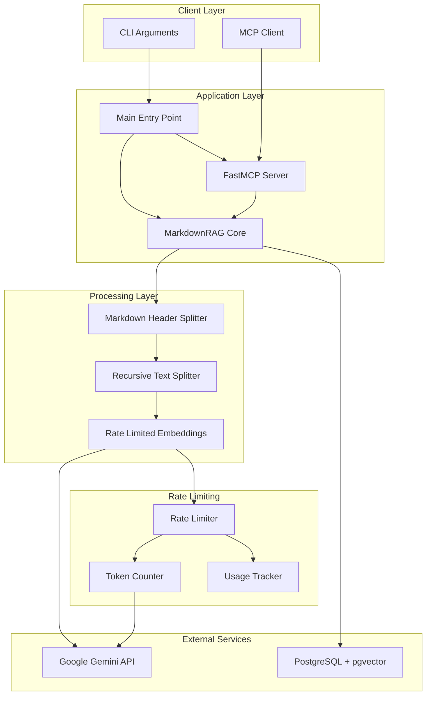
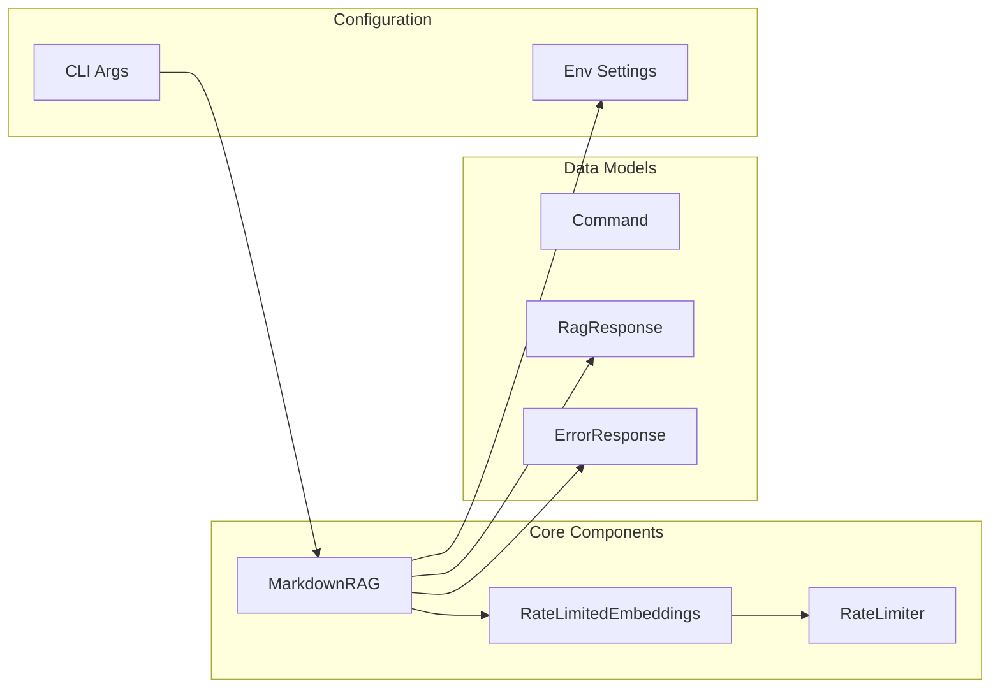
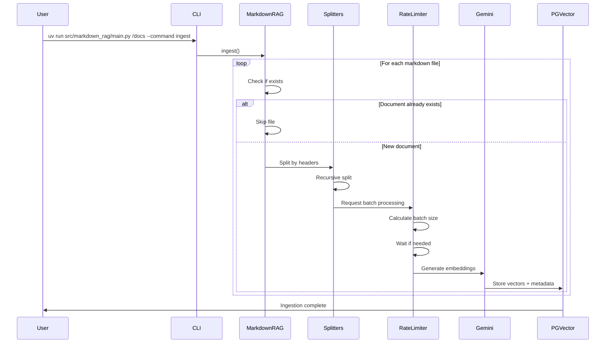
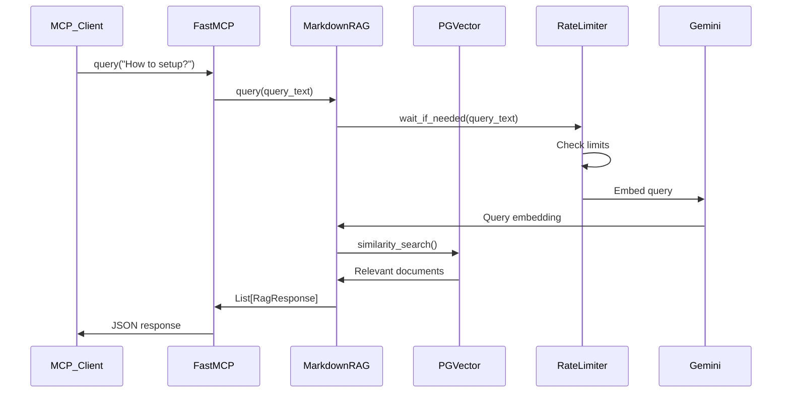
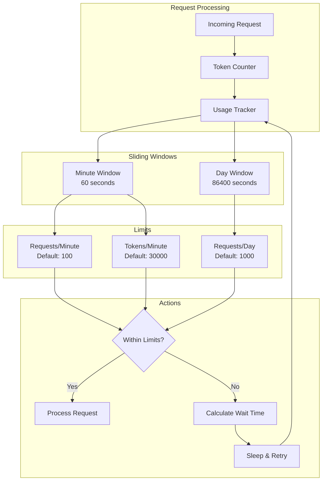

# Markdown RAG Architecture

## System Overview

The Markdown RAG system is a Retrieval Augmented Generation (RAG) solution that ingests markdown files, stores them as embeddings in a PostgreSQL vector database, and provides semantic search capabilities through an MCP (Model Context Protocol) server.

## Architecture Diagram



## Component Architecture



## Data Flow

### Ingestion Flow



### Query Flow



## Rate Limiting Architecture



## Technology Stack

| Layer               | Technology                           | Purpose                                |
| ------------------- | ------------------------------------ | -------------------------------------- |
| **Embeddings**      | Google Gemini (gemini-embedding-001) | Generate semantic embeddings from text |
| **Vector Store**    | PostgreSQL + pgvector                | Store and search vector embeddings     |
| **Framework**       | LangChain                            | Document processing and RAG pipeline   |
| **Server Protocol** | FastMCP                              | Model Context Protocol server          |
| **Configuration**   | Pydantic Settings                    | Type-safe environment config           |
| **Text Processing** | LangChain Text Splitters             | Markdown-aware chunking                |

## Key Design Patterns

### 1. Rate Limiting with Sliding Window

The system uses a sophisticated sliding window algorithm to enforce API rate limits:

- **Dual window tracking**: Separate 60-second and 24-hour windows
- **Token counting**: Counts tokens before making requests
- **Batch optimization**: Calculates maximum safe batch sizes
- **Smart waiting**: Only waits when necessary, with minimal delay

### 2. Embeddings Wrapper Pattern

`RateLimitedEmbeddings` wraps the Google Gemini embeddings model:

- Transparent rate limiting
- Automatic batching
- Seamless integration with LangChain

### 3. Document Deduplication

Before ingesting documents, the system checks if they already exist:

- Uses metadata-based queries
- Prevents duplicate embeddings
- Enables incremental updates

### 4. Hierarchical Text Splitting

Two-stage splitting strategy:

1. **Markdown Header Splitter**: Splits on headers (##, ###, ####, #####)
1. **Recursive Character Splitter**: Further splits large sections (2000 chars, 50 overlap)

This preserves semantic boundaries while maintaining manageable chunk sizes.

## Configuration

### Environment Variables

| Variable                         | Default      | Required | Description                              |
| -------------------------------- | ------------ | -------- | ---------------------------------------- |
| `POSTGRES_USER`                  | `postgres`   | No       | PostgreSQL username                      |
| `POSTGRES_PASSWORD`              | -            | **Yes**  | PostgreSQL password                      |
| `POSTGRES_HOST`                  | `localhost`  | No       | PostgreSQL host                          |
| `POSTGRES_PORT`                  | `5432`       | No       | PostgreSQL port                          |
| `POSTGRES_DB`                    | `embeddings` | No       | Database name                            |
| `GOOGLE_API_KEY`                 | -            | **Yes**  | Google Gemini API key                    |
| `RATE_LIMIT_REQUESTS_PER_MINUTE` | `100`        | No       | Max API requests per minute              |
| `RATE_LIMIT_REQUESTS_PER_DAY`    | `1000`       | No       | Max API requests per day                 |
| `DISABLED_TOOLS`                 | -            | No       | Comma-separated list of tools to disable |

### Command Line Options

```bash
uv run --directory path/to/markdown-rag markdown-rag <directory> [OPTIONS]
```

Options:

- `-c, --command {ingest|mcp}`: Operation mode (default: mcp)
- `-l, --level {debug|info|warning|error}`: Log level (default: warning)

## Performance Characteristics

### Ingestion Performance

- **Throughput**: Limited by API rate limits (100 req/min, 30K tokens/min)
- **Batching**: Automatically batches requests to maximize throughput
- **Caching**: LRU cache for token counts (size: 20)
- **Deduplication**: O(1) lookup via PostgreSQL metadata queries

### Query Performance

- **Latency**: ~100-500ms (depends on vector store size)
- **Similarity Search**: pgvector cosine similarity
- **No batching**: Queries are processed individually

### Memory Usage

- **Sliding windows**: O(R) where R = requests in 24 hours
- **Token counting cache**: O(1) - bounded at 20 entries
- **Document processing**: Streams files, minimal memory footprint

## Security Considerations

### Secrets Management

- All secrets stored in environment variables
- `SecretStr` type prevents accidental logging
- PostgreSQL DSN properly encoded

### Input Validation

- Pydantic models validate all inputs
- Type checking enforced (mypy)
- CLI arguments validated before execution

### API Key Protection

- Never logged or exposed
- Passed directly to Google client
- Field serialization controlled

## Error Handling

### Ingestion Errors

- Individual file failures logged but don't stop processing
- Duplicate detection prevents reprocessing
- Rate limit violations trigger automatic retry with backoff

### Query Errors

- Wrapped in `ErrorResponse` model
- Exceptions logged with full stack trace
- MCP client receives structured error response

### Database Errors

- Connection failures propagate to caller
- SQLAlchemy handles connection pooling
- Transactions ensure consistency
